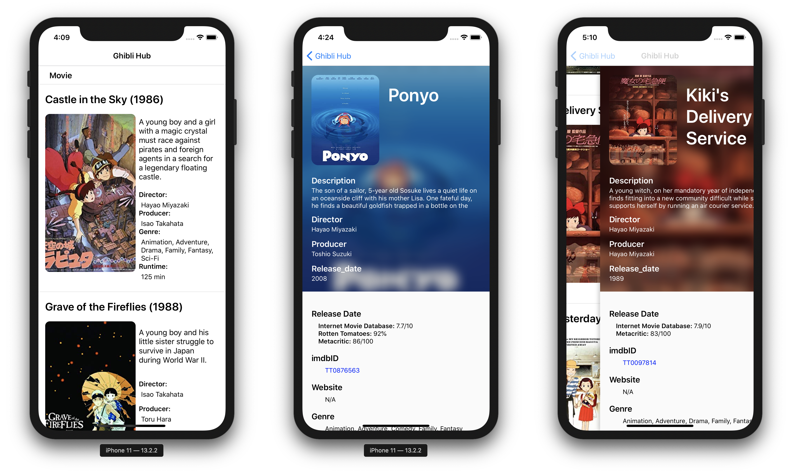

# Ghibli Hub



One iOS & Android mobile application by using React-native framework async calling public Open RESTful Apis (e.g. Studio Ghibli Api, TMDb Api), as well as AniList GraphQL Api, for fetching movie info and stage photos of firms made by Studio Ghibli.

## Build 
_Test for ios only_

``` bash
yarn install

cd ios
pod install
# prevent 'null is not an object' error

# Modify API KEYs & CUSTOMIZED_GOOGLE_SEATCH in `env.js` for showing all data

npm run ios8 #run Iphone 8 Simulator
#npm run ios8p #run Iphone 8 Plus Simulator
#npm run ios11 #run Iphone 11 Simulator
```

## Update Log
_11/25/2019_
- Replace ghibliapi with [Anilist GraphQL Api](//anilist.gitbook.io/anilist-apiv2-docs/)
- Optimize codes

_11/24/2019_
- Integrate with [themoviedbAPI](//www.themoviedb.org/documentation/api) & [Google Custom Search API](//developers.google.com/custom-search)
- Improve detail pages with highlight photos

_11/23/2019_
- init project, with basic home, and detail pages
- Integrate with [omdbapi](//omdbapi.com) & [ghibliapi](//ghibliapi.herokuapp.com/)

## License
MIT @ [Vince Cao](//vince-amazing.com)