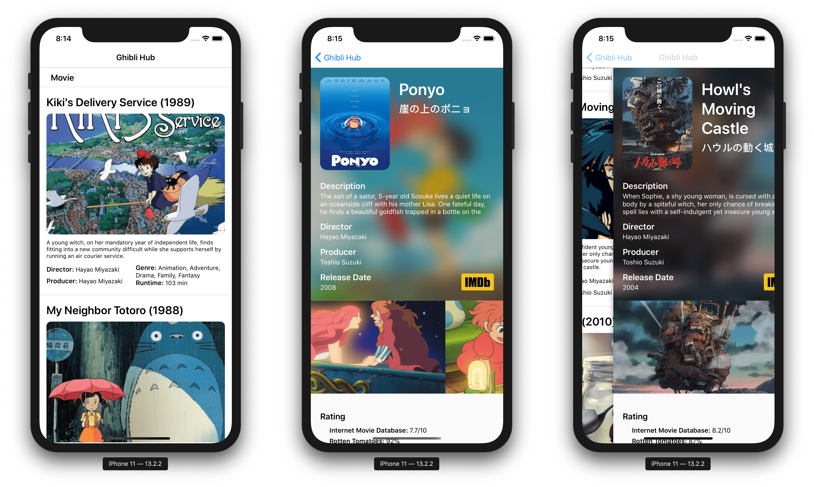
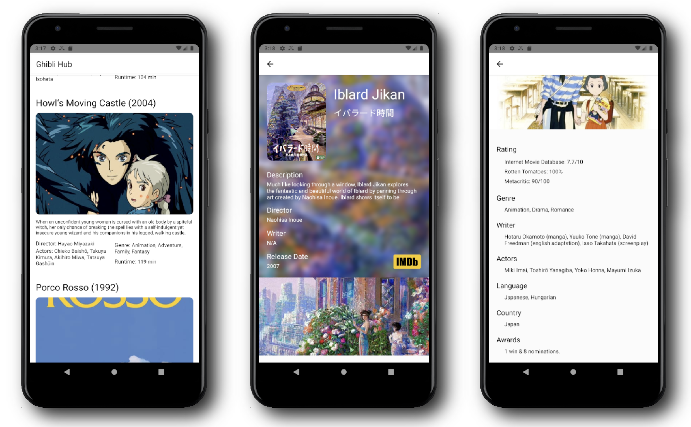

# Ghibli Hub





One iOS & Android mobile application by using React-native framework async calling public Open RESTful Apis (e.g. Studio Ghibli Api, TMDb Api), as well as AniList GraphQL Api, for fetching movie info and stage photos of firms made by Studio Ghibli.

## Build 

``` bash
# install
yarn

cd ios
pod install
# Modify API KEYs in .env

# ios
yarn ios8 #run Iphone 8 Simulator
# yarn ios8p #run Iphone 8 Plus Simulator
# yarn ios11 #run Iphone 11 Simulator

# Android
# open avd manager emulator, sdk 28 or newer
yarn android
```

## Update Log
_06/20/2022_
- Optimize code structure, fix iOS version

_06/18/2022_
- Upgrade dependencies 
- Migrate from JS to TS

_11/25/2019_
- Replace `ghibliapi` with [Anilist GraphQL Api](//anilist.gitbook.io/anilist-apiv2-docs/)
- Optimize codes

_11/24/2019_
- Integrate with [themoviedbAPI](//www.themoviedb.org/documentation/api) & [Google Custom Search API](//developers.google.com/custom-search)
- Improve detail pages with highlight photos

_11/23/2019_
- Init project with basic home and detail pages
- Integrate with [omdbapi](//omdbapi.com) & [ghibliapi](//ghibliapi.herokuapp.com/)

## License
MIT @ [Vince Cao](//vince-amazing.com)